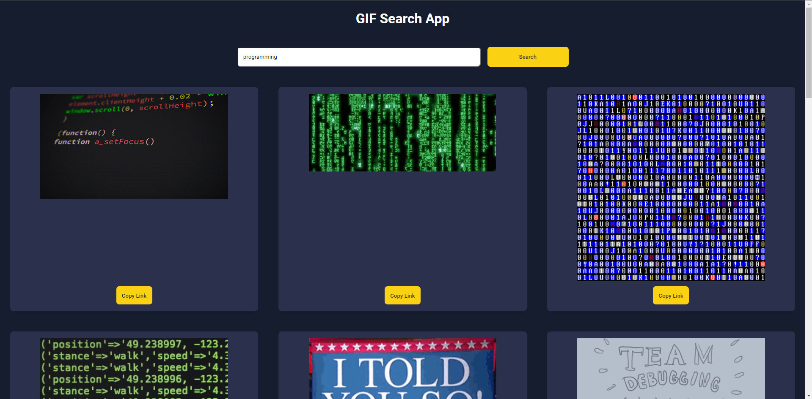

# GIF Search App

This is a simple GIF search app that uses the GIPHY API, which lets the user search for GIFs and allows them to copy the URL of the GIF to their clipboard. The app generates 20 GIFs at a time and lets the user load 20 more GIFs if they click the "Load More" button. It was written with vanilla HTML, CSS, and JavaScript.

## Features

- **GIPHY API**: This app uses the GIPHY API to fetch the GIFs.
- **Responsive Design**: Media queries are used to make the app responsive on different screen sizes.
- **Copy to Clipboard**: Users are able to copy the links of the GIFs to their clipboard.

## Core Files

- `index.html`: The main HTML file that contains the HTML components of the app.
- `style.css`: The main CSS file that contains the CSS styling of the app, including media queries for responsiveness.
- `api-key.js`: The file in which the user will copy and paste the API key.
- `script.js`: The JavaScript file that contains the logic of the app.
- `icon.png`: An icon for the browser.

## How to Run

1. Download the files from this repository.
2. Go to the <a href="https://developers.giphy.com/" target="_blank">GIPHY API</a> website and create an account.
3. Generate an API key and copy it to your clipboard.
4. Paste it in the empty string in `api-key.js`.

## Credits

This project was inspired by the video tutorial <a href="https://youtu.be/oSrwWZbEAWs?si=sn85Xw9Ydcx96GAG" target="_blank">Gif Search App | HTML, CSS & Javascript Project
</a>. The "Load More" button and title was added independently.